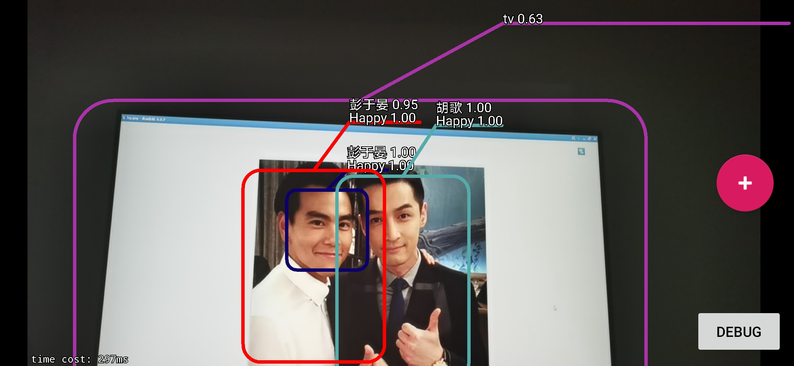

# Mobile AI

>* 本项目是Android端的实时目标检测+人脸检测+人脸识别+表情识别。
>
>* 移动端的inference框架使用了tflite和ncnn。

**Ummmm, and the source code will be released after my graduation.**

## Result

* Test on Huawei Mate30

| 模块   | 目标检测 | 人脸检测 | 人脸识别    | 表情识别  |
| ------ | -------- | -------- | ----------- | --------- |
| 分辨率 | 300*300  | 384*384  | 112*112     | 100*100   |
| 时间   | ≈ 30ms   | ≈ 70ms   | ≈ 150ms/per | ≈ 7ms/per |

